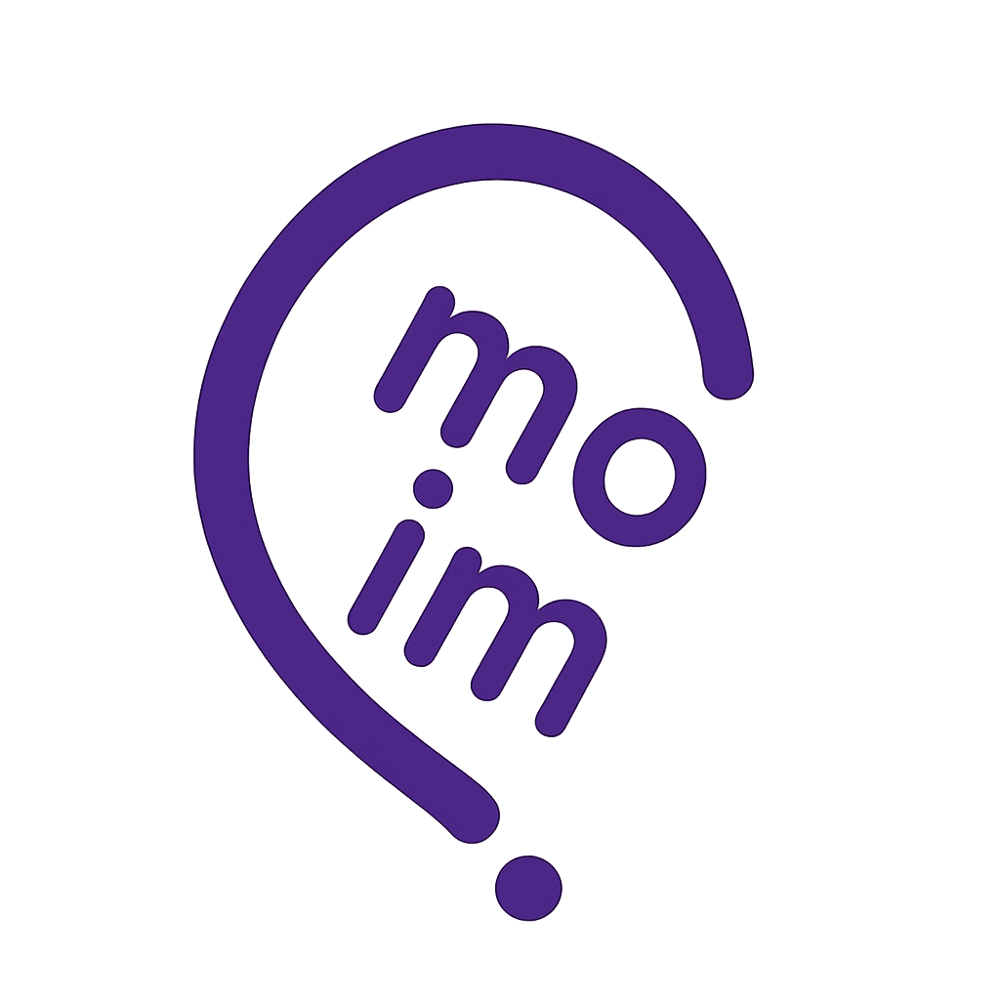

# 🌐 Moim
> MBTI 기반 동네 친구 찾기 & 모임 매칭 플랫폼  
> **“혼자가 아님을 느낄 수 있는 경험 제공”**
[📄 프로젝트 문서 (PDF 보기)](https://github.com/won-Jo0n/moim/blob/master/docs/moim.pdf)

---

## 📌 프로젝트 배경
- 최근 20~30대 청년들 사이에서 **사회적 고립감**이 증가  
- 코로나 이후 사람들과 자연스럽게 어울릴 기회 감소  
- MBTI 성향을 활용하여 **부담 없는 대화 시작**과 **안전한 커뮤니티**를 제공  

---

## 🎯 프로젝트 목표
1. 성향 기반 매칭으로 대화 시작 부담 최소화  
2. 안전한 커뮤니티 운영을 통한 장기적 신뢰 형성  
3. 온라인에서 오프라인으로 자연스럽게 이어지는 만남  

---

## 🔑 주요 기능
- ✅ 자체 회원가입 & 네이버 OAuth 로그인  
- ✅ MBTI 성향 테스트  
- ✅ 사용자 모임 & 일정 생성  
- ✅ 후기 리뷰 & 별점 시스템  
- ✅ WebSocket 기반 실시간 채팅 & 알림  
- ✅ 신고 관리 & 보안 기능  

---

## 🛠 기술 스택
- **Backend**: Spring Framework, Spring Security, WebSocket (STOMP)  
- **Frontend**: JSP, JSTL, Ajax  
- **DB**: MySQL  
- **Infra**: AWS, GitHub 형상관리  
- **OAuth**: Naver API  

---

## 🚀 프로젝트 수행 절차
1. 프로젝트 준비 및 설계  
2. 개발 착수 및 협업 (GitHub 활용)  
3. 오류 검수와 서비스 구축  
4. AWS 배포 (예정)  

---

## 📺 시연 영상
👉 (https://drive.google.com/file/d/1IHb9xr6SdozYoE7-RIzYjYQZfTg79Qe0/view?usp=drive_link)

---

## 📊 마케팅 전략 & 기대 효과
- **SNS 숏폼 마케팅**: 인스타, 틱톡, 유튜브 브이로그 활용  
- **친구 초대 리워드**: 포인트 지급 → 제휴 가게 현금처럼 사용 가능  
- **지역 상권 제휴**: 스터디룸, 공방, 피트니스 등과 제휴  

**기대 효과**  
- 플랫폼 브랜딩 강화 및 사용자 유지율 상승  
- 지역 경제 활성화 & 커뮤니티 구축  

---

## 🔮 업그레이드 방안
- 매칭 알고리즘 고도화 (관심사, 활동 빈도, 후기 반영)  
- AI 기반 개인화 추천 적용  
- 포인트·구독 기반 수익 모델 다각화  
- 모바일 앱(iOS/Android) 출시  

